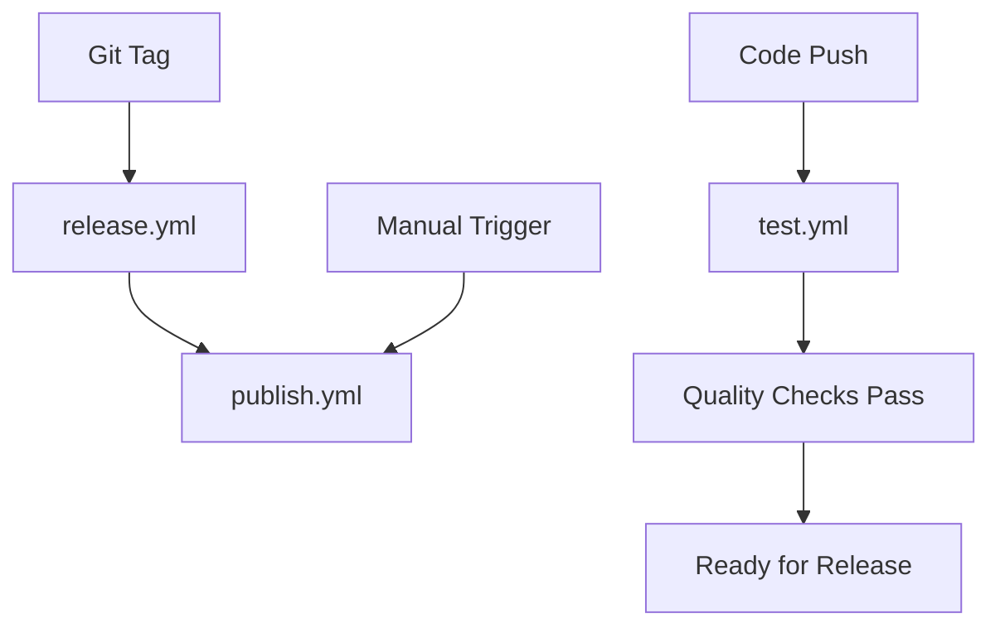

# GitHub Actions Workflows

This repository uses GitHub Actions for automated testing, building, and publishing.

## 🔄 Workflows Overview

### 1. **test.yml** - Continuous Integration
**Triggers**: Push to main/develop, Pull requests to main

**What it does**:
- Tests on multiple Python versions (3.8-3.12)
- Tests on multiple OS (Ubuntu, Windows, macOS)
- Runs comprehensive test suite
- Code quality checks (flake8, black, mypy)
- Security scanning (bandit, safety)
- Package build verification

### 2. **publish.yml** - PyPI Publishing
**Triggers**: 
- Automatic: New GitHub releases
- Manual: Workflow dispatch (with environment choice)

**What it does**:
- Runs full test suite first
- Builds wheel and source distributions
- Publishes to Test PyPI or production PyPI
- Supports both automatic and manual publishing

### 3. **release.yml** - GitHub Releases
**Triggers**: Push of version tags (v0.1.0, v1.0.0, etc.)

**What it does**:
- Creates GitHub release with changelog
- Updates version in setup.py
- Builds and attaches package files
- Generates release notes automatically

## 🚀 How to Use

### Publishing a New Version

#### Method 1: Automatic Release (Recommended)
```bash
# 1. Update version in setup.py
sed -i 's/version="0.1.0"/version="0.1.1"/' setup.py

# 2. Commit changes
git add setup.py
git commit -m "Bump version to 0.1.1"
git push origin main

# 3. Create and push tag
git tag v0.1.1
git push origin v0.1.1

# 4. Workflows automatically:
#    - Create GitHub release (release.yml)
#    - Publish to PyPI (publish.yml)
```

#### Method 2: Manual Publishing
1. Go to **Actions** tab in GitHub
2. Select **Publish to PyPI** workflow
3. Click **Run workflow**
4. Choose environment: `testpypi` or `pypi`
5. Click **Run workflow**

### Testing Changes
- **Push to main**: Runs full test suite
- **Create PR**: Runs tests on PR changes
- **Manual test**: Go to Actions → Tests → Run workflow

## 🔐 Required Secrets

Add these secrets in GitHub Settings → Secrets and variables → Actions:

### For PyPI Publishing:
```
PYPI_API_TOKEN=pypi-...          # Production PyPI token
TEST_PYPI_API_TOKEN=pypi-...     # Test PyPI token
```

### How to get tokens:
1. **Production PyPI**: https://pypi.org/manage/account/token/
2. **Test PyPI**: https://test.pypi.org/manage/account/token/

### Token Setup:
1. Create tokens with "Entire account" scope
2. Copy the token (starts with `pypi-`)
3. Add to GitHub Secrets with exact names above

## 🎯 Environments

The workflows use GitHub Environments for additional security:

### Create Environments:
1. Go to Settings → Environments
2. Create `pypi` environment
3. Create `testpypi` environment
4. Add protection rules if desired

### Environment Protection (Optional):
- **Required reviewers**: Require manual approval
- **Wait timer**: Add delay before deployment
- **Deployment branches**: Restrict to main branch

## 📋 Workflow Status

### Green ✅ - All Good
- All tests passing
- Code quality checks pass
- Package builds successfully
- Ready for release

### Red ❌ - Needs Attention
- Check the failed job in Actions tab
- Common issues:
  - Test failures
  - Code style issues (black, flake8)
  - Build problems
  - Missing secrets

## 🔧 Customization

### Modify Test Matrix
Edit `.github/workflows/test.yml`:
```yaml
strategy:
  matrix:
    python-version: ["3.8", "3.11"]  # Reduce for faster runs
    os: [ubuntu-latest]              # Single OS for speed
```

### Change Version Pattern
Edit `.github/workflows/release.yml`:
```yaml
on:
  push:
    tags:
      - '[0-9]+.[0-9]+.[0-9]+'  # Match semantic versioning
```

### Add More Checks
Add to test workflow:
```yaml
- name: Run additional tests
  run: |
    pytest tests/
    coverage run -m pytest
    coverage report
```

## 📊 Monitoring

### View Workflow Runs:
- Go to **Actions** tab in GitHub
- Click on specific workflow run
- View logs and download artifacts

### Artifacts Available:
- Built packages (wheel + source)
- Test reports
- Coverage reports (if configured)

### Notifications:
- GitHub will email on workflow failures
- Configure Slack/Discord webhooks if needed

## 🔄 Workflow Dependencies



## 🆘 Troubleshooting

### Common Issues:

#### "Invalid API token"
- Check token is correct in GitHub Secrets
- Verify token has correct permissions
- Try regenerating token

#### "Package already exists"
- Version already published to PyPI
- Bump version number in setup.py

#### "Tests failing"
- Check test logs in Actions tab
- Run tests locally: `python test_validation_schema_comprehensive.py`

#### "Build failing"
- Check dependencies in requirements.txt
- Verify setup.py configuration

### Getting Help:
1. Check workflow logs in Actions tab
2. Review this documentation
3. Check PyPI upload guides
4. Open issue if needed